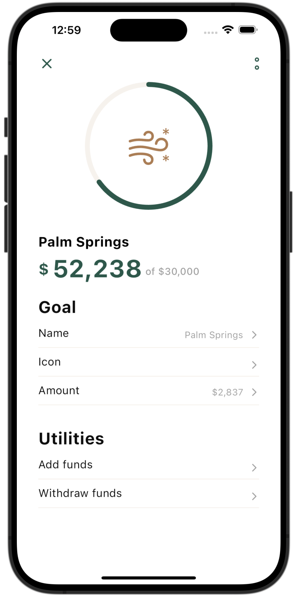

# Banking Store

A mobile application built with FLutter framework.

## Dependencies

The following packages are used as dependencies in this project:
- **fl_chart:** ^0.66.0   ` FL Chart is a highly customizable Flutter chart library that supports Line Chart, Bar Chart, Pie Chart, Scatter Chart, and Radar Char`
- **flutter_svg_provider:** ^1.0.7    `A Flutter package for using svg in Image widget via custom ImageProvider`

## Screenshots

